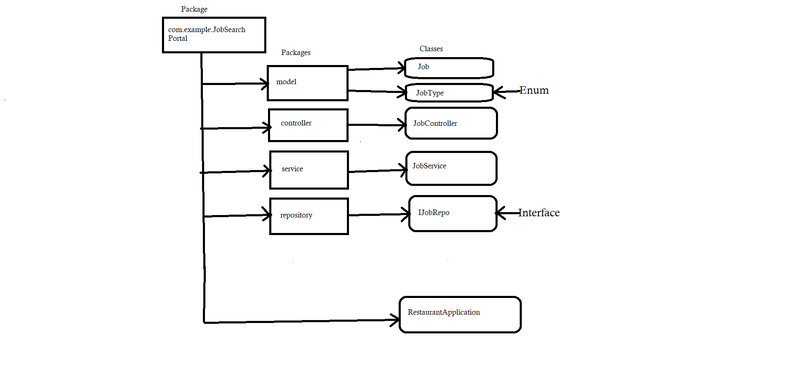

## Frameworks and language used 
* SpringBoot Framework and java language.
## Data Flow

## Data Structure used in your project
* Arraylist
## Project Summary

This is the "Job Search Portal" Application which following the mvc-Architecture.I have used here h2 Database and JPA Dependency to connect with Database and get the Information in the form of Tables. I have created a package of JobSearchPortal within this package I have created Five more packages to define layer as given in DFD. In this project a Model Job has  the attributes which making our application in readable format So here we are validating the data with the help of validations by performing crud operations on it with the help of endpoints like @GetMapping to get all the data of the Job , @PostMapping to create a Job portal using the attributes,
@PutMapping to update the perticular JobPortal By Passing needed Attribute which information we want to update using their Id, @deleteMapping to remove a JobPortal from list by giving specific Id.That's the whole project meant. 